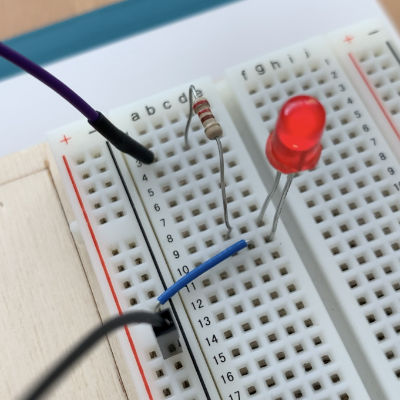

# TinyML "Hello World" on Arduino Uno v3




Recently I've become interested in **TinyML**, or running machine learning models on (ultra) low-power microcontrollers.

The book *[TinyML: Machine Learning with TensorFlow Lite on Arduino and Ultra-Low-Power Microcontrollers](https://tinymlbook.com)* by Pete Warden and Daniel Situnayake starts off with a very basic sine wave prediction model. This model is then used to control the brightness of an LED. You can find the original source code for this **hello_world** example in the [TensorFlow Lite for Microcontrollers repo](https://github.com/tensorflow/tensorflow/tree/master/tensorflow/lite/micro/examples/hello_world).

The book and repo demonstrate how to run the model on an Arduino Nano 33 BLE Sense or Arduino MKRZERO, but the only Arduino I have lying around here at the moment is an **Arduino Uno v3**. And TF Lite Micro does not appear to run on the Uno. Not surprisingly, as even this very simple model already requires more RAM than the Uno has (only 2 KB).

But of course you don't *need* TF Lite to run machine learning models, you can also [implement the logic](SineExample/model.cpp) yourself. ;-)

## How to hook up the Arduino

Pretty simple. Just attach an LED to pin 11 (or another PWM output), in series with a small resistor:

```nohighlight
+---------+
| A       |
| r   ~11 |---- 220 Ω ----+
| d       |               |
| u       |              LED
| i       |               |
| n   GND |---------------+
| o       |
+---------+
```

The Arduino sketch will send a sine wave over pin 11, which makes the LED appear to pulsate. Rather than calling `sin()`, it uses a machine learning model to approximate the sine wave.

Note: The Uno also has a built-in LED on pin 13, but that doesn't support PWM. If you use pin 13, the LED will just blink on and off.

## Training the model

[This Jupyter notebook](train_hello_world_model.ipynb) shows how to train the model using TensorFlow 2. I took this notebook from the TF Lite repo and tweaked it a little. Notably, the model does not get exported as a .tflite file, but the notebook simply dumps the weights as C arrays that you can copy-paste into [model_data.cpp](SineExample/model_data.cpp).

## Model architecture

The model consists of the following layers:

1. input layer, 1 neuron
2. dense layer, 16 neurons, ReLU activation
3. dense layer, 16 neurons, ReLU activation
4. dense layer, 1 neuron, no activation

There are three weight matrices:

- **W1** shape (1, 16)
- **W2** shape (16, 16)
- **W3** shape (16, 1)

Of course, each layer also has bias parameters.

Notice that the weight matrices for the first and last layer are really vectors because there is only one input neuron and one output neuron.

In total there are 321 parameters. If we store those as 32-bit floats, it takes up 1284 bytes. That's small enough to fit even in the Arduino Uno's memory.

## Inference

Since we're not using TF Lite, we'll have to implement the layer math ourselves. All the layers are dense / fully-connected layers but because the input and output are scalars, the logic for the input and output layers can be simplified a little.

The model needs to perform these different functions:

1. scalar-vector multiplication for the first layer
2. vector-matrix multiplication for the middle layer
3. dot product for the last layer
4. (vector) addition for the bias terms
5. ReLU

Fortunately, these are pretty simple to implement. You can find the full source code in [model.cpp](SineExample/model.cpp). It's less code than you might think!

## Memory usage

The current version of the code works with 32-bit floats, no quantization is used. Therefore, every weight and every activation uses up 4 bytes of memory.

The Arduino Uno v3 only has 2 KB of RAM. All your global and local variables need to fit inside this tiny amount of memory! 

The Uno also has 32 KB of read-only flash storage. As our model's weights already take up 1284 bytes, it makes sense to put them in flash memory. That leaves the RAM free for other things.

The final program uses about 5000 bytes of flash memory (out of 32K). Even better, it uses less than 200 bytes of RAM for its global variables. That's about 10% of the space we have available.

Note: Because we put the weights in flash memory (using `PROGMEM`), we also need to use special instructions such as `pgm_read_float_near()` to read them into RAM before we can use them. We can read the weights from ROM into RAM one at a time, so it's still very memory-efficient. However, I guess (?!) that reading from flash might be slower than reading from RAM (but I did not verify this).

The implementation of the neural network logic only needs to store the 16 activations of the first layer. Normally you'd also need to store the 16 activations of the second layer, but because the output layer only has a single neuron we can optimize this away. In total, running `predict()` uses 100 or so bytes on the stack.

## Is this approach better than using TF Lite?

It depends. :)

We're doing the same task as the TF Lite Micro model but with a lot less memory. There's overhead in loading a .tflite file and running it through an interpreter. By doing everything yourself, you can avoid that overhead. I'm sure this could be optimized much more still. 

Does it always make sense to implement the neural network logic by hand? Probably not. For one thing, it's a lot less effort to use a framework such as TF Lite. Without such a framework, you always have to hardcode the entire model. If the model architecture changes, you also end up rewriting your logic.

But if you're *really* resource-constrained, "rolling your own" might be the way to go. 

## TODO

- Optimize the code? Right now it's just a bunch of `for` loops. I have no idea if the ATmega328P CPU has vector operations that would make the dot products go faster.

- Quantized version. Use uint8 weights instead of floats.

## License

Apache License 2.0 (same as TensorFlow)
